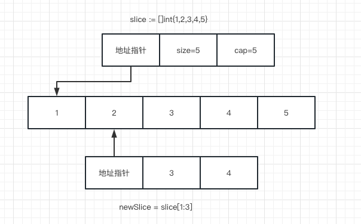

go语言中，切片是一个动态可扩容的数组。底层有三个字段操作切片， 指向底层数组的指针、切片元素个数len、切片的容量cap。

#### 编译时

[compile/internal/types/type.go]()是编译期间用于创建切片类型的函数:

```go
// NewSlice returns the slice Type with element type elem.
func NewSlice(elem *Type) *Type {
	// 该类型的切片是否第一次初始化
  if t := elem.cache.slice; t != nil {
		if t.Elem() != elem {
			base.Fatalf("elem mismatch")
		}
		if elem.HasTParam() != t.HasTParam() || elem.HasShape() != t.HasShape() {
			base.Fatalf("Incorrect HasTParam/HasShape flag for cached slice type")
		}
		return t
	}
  // 通过newType()方法创建Type， 并且extra字段赋值为切片的类型，帮助后面运行时获取该类型
	t := newType(TSLICE)
	t.extra = Slice{Elem: elem}
	elem.cache.slice = t
	if elem.HasTParam() {
		t.SetHasTParam(true)
	}
	if elem.HasShape() {
		t.SetHasShape(true)
	}
	return t
}
```

### 运行时

运行时通过[reflect/value.go]()表示切片，这便是我们熟知的切片的结构，指向底层数组的指针、元素个数、容量大小

```go
type SliceHeader struct {
	Data uintptr
	Len  int
	Cap  int
}
```


### 创建和初始化

一般创建使用 `make`进行，

```go
// make([]type, size, cap)
// 创建一个cap个容量、size个元素的切片
slice := make([]int, 0, 6)
```

**Tips:**

>  在slice初始化时，如果我们可以提前知道append的元素大小，我们必须在初始化时将cap置为元素的个数大小，这样可以避免后续切片的扩容,如果不知晓元素大小的情况下，一般用slice := make([]int)进行初始化


### 赋值和切片

下面我们进行一个示例讲解

```go
slice := []int{1,2,3,4,5}
newSlice := slice[1:3]
上面情况下，newSlice和slice共享同一个底层数组
```



1. 对底层数组容量是k的切片slice[i:j]来说

- 长度: j-i
- 容量：k-i

2. 修改某个索引的切片会导致slice/newSlice都进行更新
